# 🛡️ AegisEscrow: Verifiable AI-Adjudicated Agent Escrow & Milestone Gate

[](https://opensource.org/licenses/MIT)
[](https://docs.genlayer.com)
[](https://github.com/genlayerlabs)
[](#-test-suite--verification)

**AegisEscrow** is a decentralized, intelligent escrow protocol built natively on GenLayer. It enables trustless milestone-based agreements between autonomous AI agents and human contributors where **milestone completion is adjudicated via multi-validator neural consensus grounded on live web evidence** (GitHub PRs, test reports, live APIs, and deployment URLs).

---

## 💡 The Problem & GenLayer Value Proposition

In the emerging agentic economy (ERC-8004, Agent-to-Agent transactions), agents can autonomously fund and contract tasks. However:
1. **Traditional Smart Contracts** can only verify deterministic on-chain events (e.g. token transfers), making off-chain deliverable verification impossible without centralized oracles.
2. **Centralized Escrow Platforms** introduce single points of failure, subjective bias, and counterparty friction.

**AegisEscrow solves this natively on GenLayer** by combining:
- **`gl.nondet.web.get`**: Live extraction of GitHub PR statuses, build artifacts, and test summaries.
- **`gl.nondet.exec_prompt`**: Multi-axis evaluation of deliverables against contractual specifications.
- **`gl.vm.run_nondet_unsafe`**: Multi-validator consensus enforcing the **Equivalence Principle** (±8 pt tolerance across 3 orthogonal dimensions).
- **Deterministic Settlement Gate**: Automatic release of GEN token funds upon verified consensus.

---

## 🏛️ System Architecture

```mermaid
sequenceDiagram
    autonumber
    actor Client as 👤 Client / Agent
    participant Escrow as 🛡️ AegisEscrow (GenVM)
    actor Contractor as 👨‍💻 Contractor
    participant Validators as ⚖️ GenLayer Validators (Optimistic Democracy)
    participant Web as 🌐 Web Evidence (GitHub / CI)

    Client->>Escrow: create_agreement(contractor) + deposit GEN
    Client->>Escrow: add_milestone(spec_desc, evidence_url, payout)
    Contractor->>Escrow: submit_and_adjudicate_milestone(notes)
    
    rect rgb(15, 23, 42)
        Note over Escrow,Validators: Non-Deterministic Multi-Validator Consensus
        Validators->>Web: gl.nondet.web.get(evidence_url)
        Validators->>Validators: gl.nondet.exec_prompt(Multi-Axis Scoring)
        Validators->>Validators: Equivalence Principle Check (±8 pt tolerance)
    end

    alt Consensus Passing (Score >= 70 & No Critical Defects)
        Escrow->>Contractor: emit_transfer(payout_amount) [APPROVED]
    else Defective / Incomplete
        Escrow-->>Contractor: status = REVISION_REQUIRED
    end
```



---

## 🔬 Multi-Axis Consensus & Equivalence Principle

Unlike naive single-score systems, AegisEscrow evaluates deliverables across **4 orthogonal dimensions**:

| Dimension | Metric | Weight / Threshold |
|---|---|---|
| **Functional Completeness** | Did the deliverable fulfill core technical specs? | `>= 70 / 100` |
| **Acceptance Criteria** | Were all defined deliverables & edge cases met? | `>= 70 / 100` |
| **Code / Artifact Quality** | Code structure, test pass rates, documentation | `>= 70 / 100` |
| **Defect Severity** | Assessment of remaining issues | Must be `NONE` or `LOW` |

### Validator Agreement Rule (`validator_fn`):
1. **Numeric Tolerance**: Validator and leader scores across all 3 continuous dimensions must not differ by more than **`±8 points`**.
2. **Verdict Equivalence**: Both must reach the exact same binary `approved` outcome.
3. **Severity Check**: A leader reporting `NONE` cannot pass if validator identifies `CRITICAL` defects.

---

## 📁 Repository Structure

```
aegis-escrow/
├── contracts/
│   └── aegis_escrow.py        # Core Intelligent Contract on GenVM
├── tests/
│   └── direct/
│       └── test_aegis_escrow.py  # Foundry-style in-memory direct VM test suite
├── frontend/
│   └── index.html             # Interactive Glassmorphic DApp UI
├── requirements.txt           # Python dependencies (genlayer-test, genvm-linter)
└── README.md                  # Complete architectural & technical documentation
```

---

## 🧪 Test Suite & Verification

The contract includes comprehensive test cases covering full settlement, quality rejections, and unauthorized access:

```bash
# Run direct in-memory tests (no server/docker required)
pytest tests/direct/ -v
```

### Verified Test Cases:
1. `test_escrow_lifecycle_and_adjudication`:
   - Client creates agreement and locks 100 GEN.
   - Client specifies verifiable milestone with 50 GEN payout.
   - Contractor submits live GitHub PR evidence.
   - Validators reach multi-axis consensus (92/88/95) and release 50 GEN.
2. `test_milestone_rejection_on_low_quality`:
   - Sub-threshold deliverable (404 web evidence, high defects) is flagged as `REVISION_REQUIRED` with escrow funds protected.
3. `test_refund_unclaimed_balance`:
   - Reverts unauthorized callers attempting to withdraw escrow funds.
   - Validates client reclaiming unspent balance.

---

## 🚀 Deployment & Usage

### 1. GenLayer Studio (Browser IDE)
1. Open [studio.genlayer.com](https://studio.genlayer.com).
2. Create a new contract file `aegis_escrow.py` and paste `contracts/aegis_escrow.py`.
3. Deploy to **Studionet** or **Testnet Bradbury** (`Chain ID: 4221`).

### 2. Interaction via GenLayer JS
```typescript
import { createClient, createAccount } from 'genlayer-js';
import { testnetBradbury } from 'genlayer-js/chains';

const client = createClient({
  chain: testnetBradbury,
  account: createAccount(),
});

// Create Agreement with 10 GEN deposit
const txHash = await client.writeContract({
  address: AEGIS_ESCROW_ADDRESS,
  functionName: 'create_agreement',
  args: ['0xContractorAddress...'],
  value: BigInt(10) * BigInt(10 ** 18),
});
```

---

## 📄 License

MIT © [Lesnak1](https://github.com/Lesnak1) & GenLayer Community
